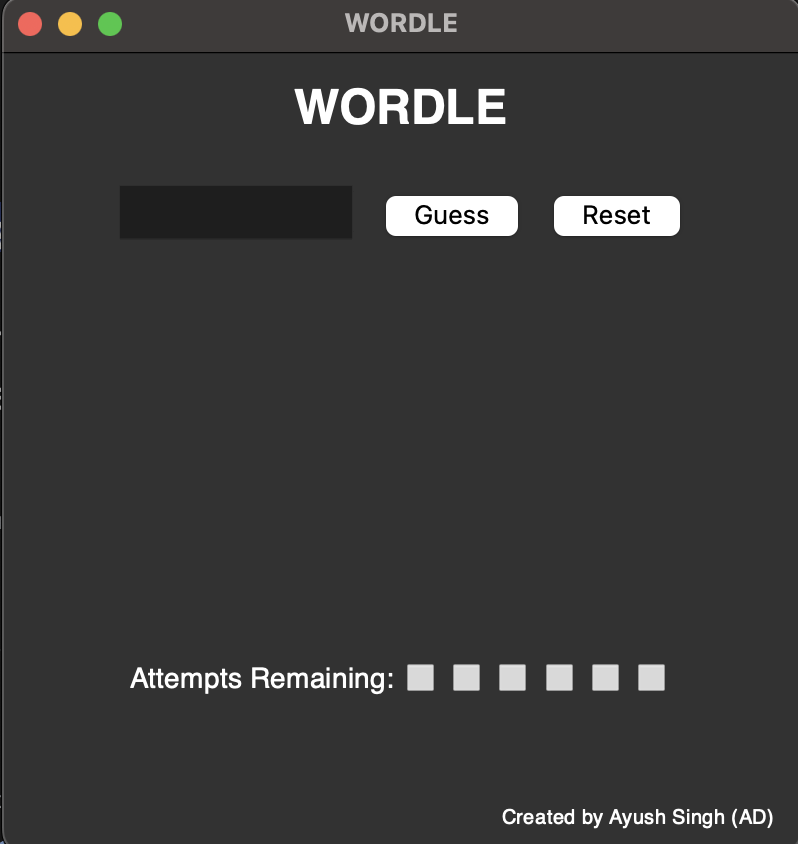

# Wordle_Game
Wordle is a daily word game that involves figuring out a secret five-letter word. You play by guessing different five-letter words to see how close they are to the secret word. You have to guess 5 letter word in 6 attempts and based on the color of your guess you would know if a character is in the word (Yellow), in the exact position(Green) or not in the word at all(Grey).

 
